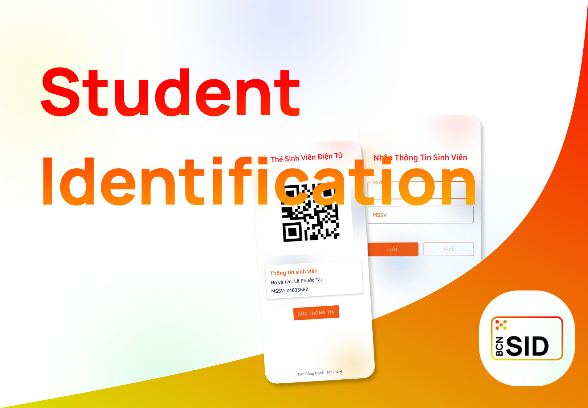
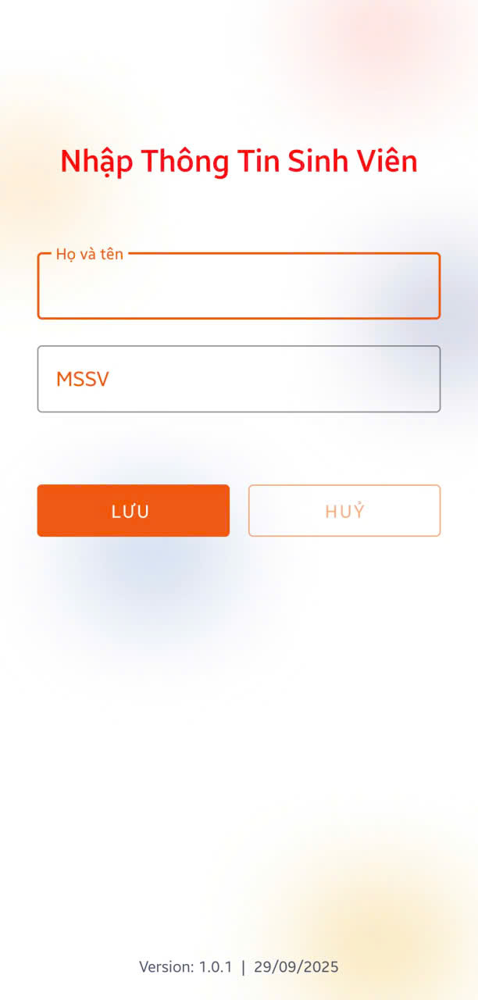

# Student ID - Thẻ Sinh Viên Điện Tử**


<p align="center">
  
</p>

**Student ID** là ứng dụng tạo thẻ sinh viên điện tử có mã QR code, dành cho tân sinh viên chưa có thẻ vật lý, giúp dễ dàng sử dụng các dịch vụ của trường.

## 📱 Tính năng chính

- Tạo mã QR từ MSSV để sử dụng các dịch vụ trong trường
- Lưu thông tin cá nhân (Họ tên và MSSV) để không phải nhập lại
- Giao diện trực quan, đơn giản, dễ sử dụng

## 📸 Overview

<p align="center">
  
  
</p>

## 🛠️ Công nghệ sử dụng

- **Ngôn ngữ**: Java
- **Thư viện QR code**: ZXing
- **Lưu trữ dữ liệu**: SharedPreferences
- **Thiết kế UI**: Material Design Components

## 📋 Yêu cầu

- Android 7.0 (API level 24) trở lên
- Hỗ trợ chế độ màn hình dọc
- Light mode

## 📖 Hướng dẫn sử dụng

1. **Lần đầu sử dụng**: Nhập họ tên và MSSV (đúng 8 chữ số)
2. **Xem thông tin**: Mã QR được tạo tự động và hiển thị cùng thông tin cá nhân
3. **Chỉnh sửa thông tin**: Nhấn vào nút "Sửa thông tin" để thay đổi thông tin đã lưu

## 📐 Kiến trúc ứng dụng

Ứng dụng được thiết kế theo mô hình OOP, với các thành phần chính:

- **MainActivity**: Hiển thị thẻ sinh viên điện tử với mã QR
- **EditInfoActivity**: Nhập và chỉnh sửa thông tin sinh viên
- **Student**: Đối tượng lưu trữ thông tin sinh viên
- **StudentManager**: Quản lý thao tác với dữ liệu sinh viên

## 🚀 Cài đặt

1. Tải và cài đặt file APK từ **[Releases](https://github.com/lephuoctai/TheSinhVienDienTu/releases/latest)**  
2. Hoặc clone project và build từ source:
   ```bash
   git clone https://github.com/yourusername/TheSinhVienDienTu.git
   cd TheSinhVienDienTu
   ./gradlew installDebug
   ```

## 📜 Giấy phép

Phát triển bởi Ban Công Nghệ - FIT - IUH.

